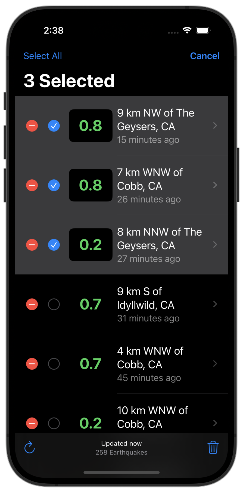

#  Earthquakes

💥 A SwiftUI app that displays and filters earthquake data from USGS. This app was written to explore new features and constructs within SwiftUI. It is a good sample app to start learning SwiftUI, complete with network requests, and persistent data.

## Screens
| Main screen | Earthquakes info | Edit Mode |
| ----------- | ------------------- | ----------------- |
 |  | 

## User flow

## Features
* SwiftUI 🦄
* USGS API
* async / await
* Concurrent design
* Task group
* Testable components
* Customized decoding
* Pull to Refresh earthquakes
* MapKit to show an earthquake location
